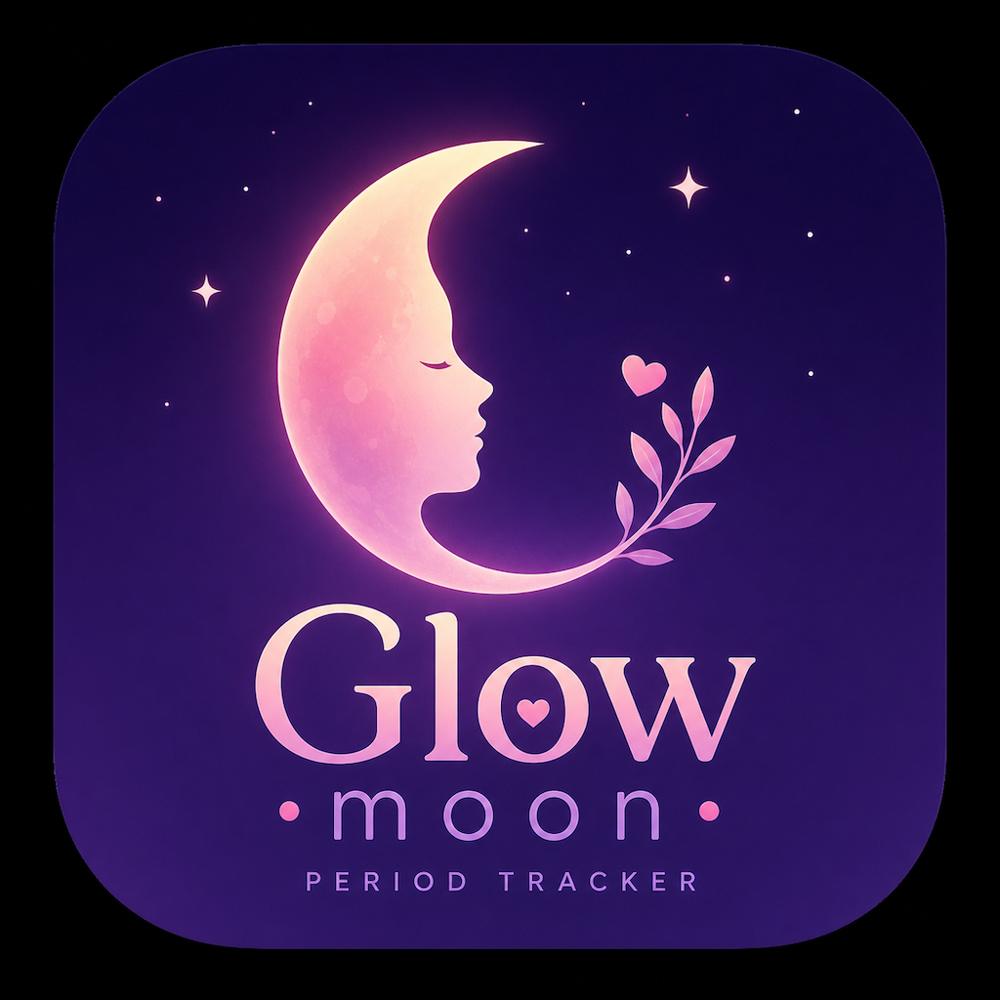
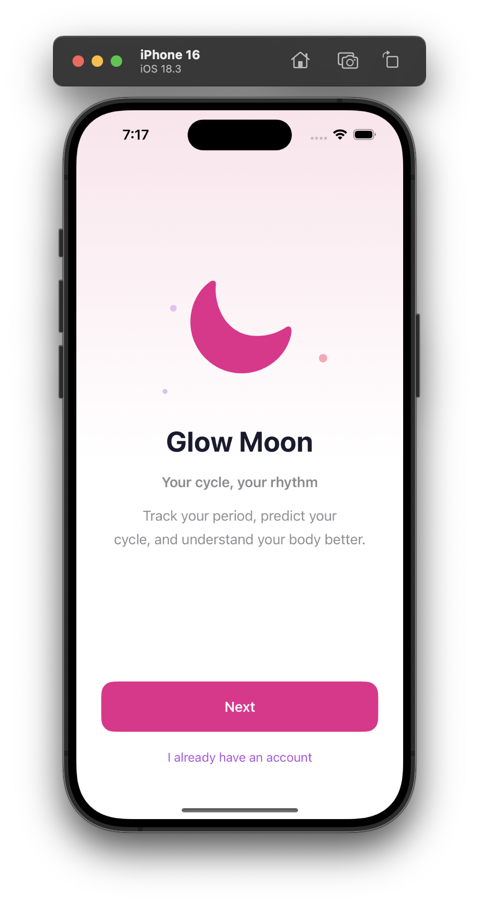
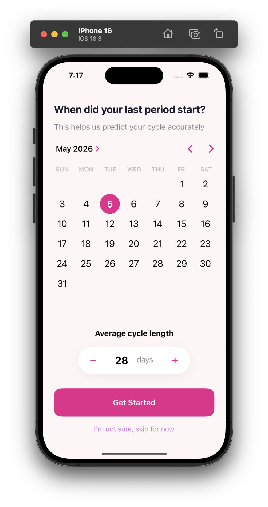
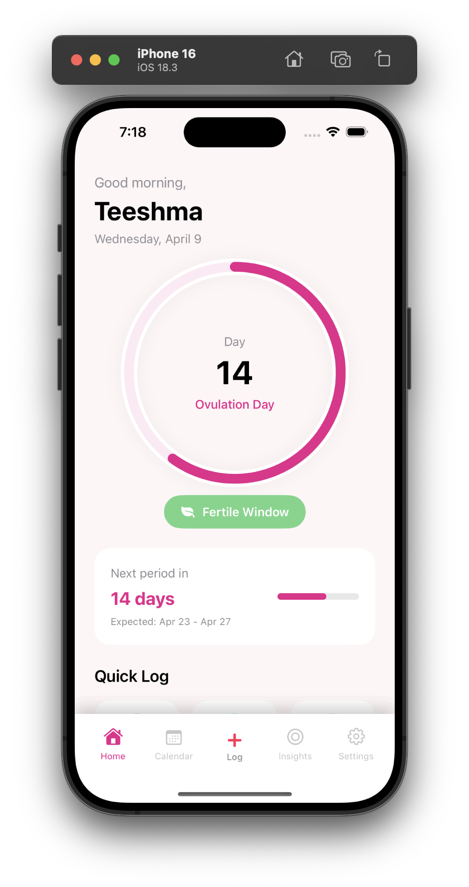
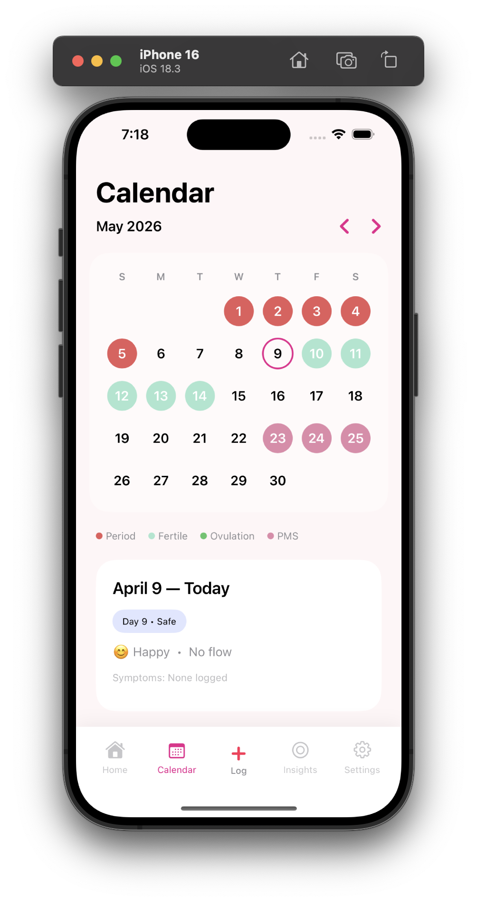
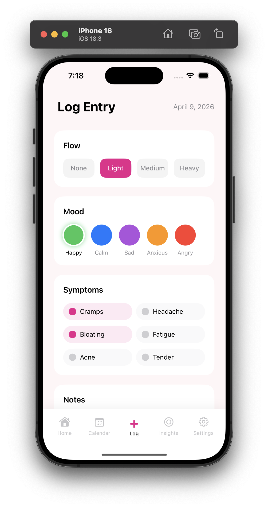
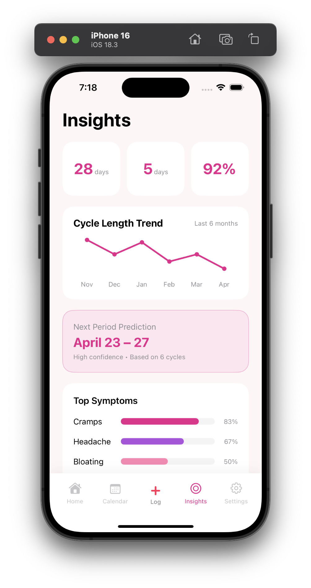
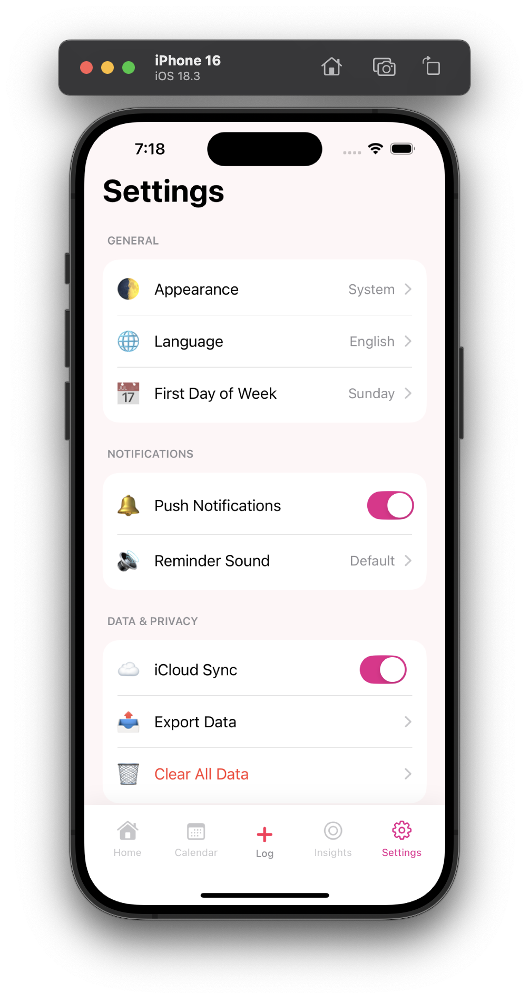

<div align="center">



# 🌙 Glow Moon

### *Your Cycle, Your Rhythm*

**A beautiful, private period & cycle tracking app for iOS — built with SwiftUI**

[](https://swift.org)
[](https://developer.apple.com/xcode/swiftui/)
[](https://developer.apple.com/xcode/)
[](https://developer.apple.com/icloud/)
[](#license)

[**View Website**](https://teesma-dev.github.io/GlowMoon) · [**Download ZIP**](https://github.com/teesma-dev/GlowMoon/archive/refs/heads/main.zip)  · [**☕ Buy Me a Coffee**](https://buymeacoffee.com/teeshmateex)

</div>

---

## ✨ About

**Glow Moon** is a free, open-source iOS app that helps you track your menstrual cycle, predict upcoming phases, and understand your body — all with a beautiful, intuitive interface. Your data stays **private and secure** with iCloud sync across your Apple devices.

No subscriptions. No ads. Just clarity.

---

## 📱 Screenshots

<div align="center">

| Welcome | Setup | Home | Calendar | Log | Insights | Settings |
|:-:|:-:|:-:|:-:|:-:|:-:|:-:|
|  |  |  |  |  |  |  |

</div>

---

## 🌸 Features

### 🌙 Cycle Tracking
Log your period start date and average cycle length. Glow Moon automatically predicts every phase — period, fertile window, ovulation, and PMS — with high accuracy across future months.

### 🗓️ Visual Calendar
A color-coded calendar gives you an instant overview of your entire cycle at a glance.

| Color | Phase |
|---|---|
| 🔴 Red | Period Days |
| 🩵 Teal | Fertile Window |
| 🟢 Green | Ovulation Day |
| 🩷 Pink | PMS Days |
| 💗 Hot Pink | Today |

### 🌿 Fertile Window Prediction
Know exactly when your fertile window opens and when ovulation day arrives — calculated automatically from your cycle data.

### 📝 Daily Log
Each day, log:
- **Flow intensity** — Light, Medium, Heavy
- **Mood** — 😊 Happy · 😌 Calm · 😔 Sad · 😟 Anxious · 😠 Angry
- **Symptoms** — Cramps, Headache, Bloating, and more
- **Personal notes** — free-text journal entry

### 📊 Smart Insights
Turn your logs into patterns:
- Cycle length trend chart (last 6 months)
- Top symptoms breakdown with percentages
- Prediction confidence score
- Average period duration
- Upcoming period predictions

### ☁️ iCloud Sync
All your data syncs privately across your iPhone, iPad, and other Apple devices via iCloud — secure, seamless, and always backed up.

### 🔔 Push Notifications
Stay ahead of your cycle with timely reminders:
- Period approaching alert
- Fertile window reminder
- Ovulation day notification
- Daily logging prompt

### ⚙️ Personalised Settings
- Light / Dark / System appearance
- Language preferences
- First day of week
- Notification sound choices
- Full data export (JSON / CSV)

---

## 🚀 Getting Started

### Requirements

| Requirement | Version |
|---|---|
| iOS | 16.0+ |
| Xcode | 15.0+ |
| Swift | 5.0 |
| iCloud Account | Optional (for sync) |

### Installation

1. **Clone the repository**
   ```bash
   git clone https://github.com/teesma-dev/GlowMoon.git
   ```

2. **Open in Xcode**
   ```bash
   cd GlowMoon
   open GlowMoon.xcodeproj
   ```

3. **Select your target device** — a real iPhone or the iOS Simulator

4. **Build and run**
   ```
   ⌘ + R
   ```

> **iCloud Sync** requires a real device with an iCloud account signed in. It is fully optional — the app works without it.

---

## 🔮 Prediction Logic

Glow Moon uses a **standard calendar-based algorithm** to predict cycle phases:

```
Ovulation Day   = Period Start + (Cycle Length - 14)
Fertile Window  = Ovulation Day - 5  →  Ovulation Day + 1
PMS Window      = Ovulation Day + 2  →  Next Period - 1
Next Period     = Period Start + Cycle Length
```

Predictions become more confident the more cycles you log. The insights screen shows a **confidence score** based on cycle regularity.

---

## 📄 License

This project is licensed under the **MIT License** — see the [LICENSE](LICENSE) file for details.

```
MIT License — free to use, modify, and distribute with attribution.
```

---

## ☕ Support

Glow Moon is completely free and open-source. If it helps you understand your body and plan your month with confidence, consider supporting the work behind it!

<div align="center">

[](https://buymeacoffee.com/teeshmateex)

</div>

---

## 👩‍💻 Developer

<div align="center">

**Teesma M**

iOS Developer · Chennai, India 🇮🇳

*Passionate about building beautiful, purposeful apps that genuinely improve everyday life.*

[](https://github.com/teesma-dev)
[](mailto:teesma.dev@gmail.com)

</div>

---

<div align="center">

Built with 🩷 in Chennai, India

**⭐ Star this repo if Glow Moon helps you!**

</div>
